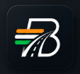
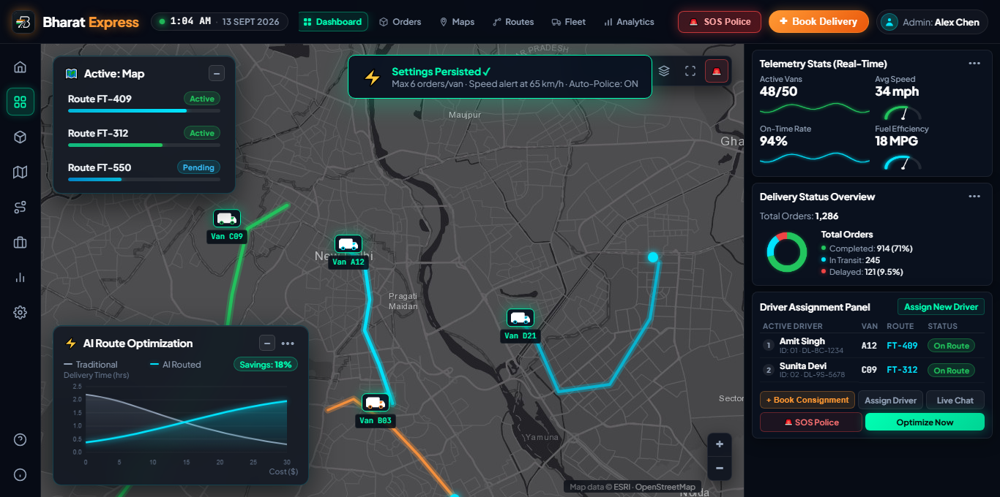
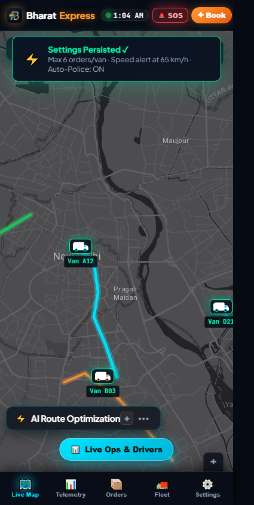
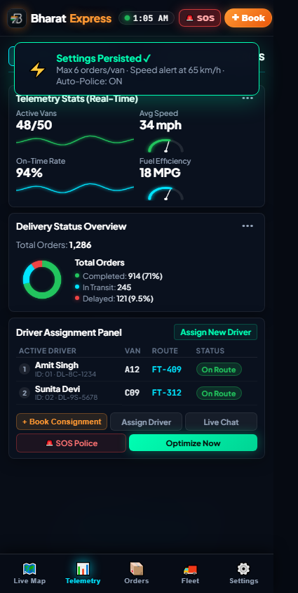
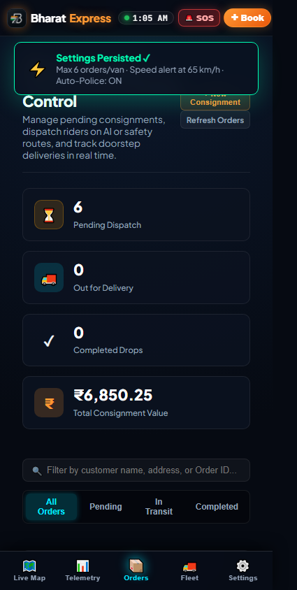

# 🚚 Bharat Express (भारत एक्सप्रेस) - AI-Powered Smart Logistics & Autonomous Control Room

<div align="center">



### **India's Autonomous Last-Mile Logistics Infrastructure & Real-Time Telemetry Control Center**

[](https://nodejs.org)
[](https://expressjs.com)
[](https://leafletjs.com)
[](https://www.esri.com)
[](https://bharat-express.onrender.com/)
[](https://en.wikipedia.org/wiki/India)
[](LICENSE)

[🚀 Launch Live Demo (Render)](https://bharat-express.onrender.com/) • [💻 Local Control Room](http://localhost:3005) • [📖 Section Knowledge Base](#-system-sections--operational-knowledge) • [🗺️ Indian Spatial Hubs](#️-interactive-indian-map--telemetry) • [🤖 AI Routing Engine](#-ai-routing-engine--algorithms) • [📡 API Reference](#-rest-api-documentation) • [⚡ Setup Guide](#-quick-start--installation)

</div>

---

## 📑 Table of Contents

1. [Executive Summary & Company Background](#-executive-summary--company-background)
2. [Key Architecture & UI Design System](#-key-architecture--ui-design-system)
3. [Responsive Architecture & Mobile-Friendly Experience](#-responsive-architecture--mobile-friendly-experience)
   - [💻 Laptop Resolution Tuning (1366 × 768 / 1280 × 800)](#-laptop-resolution-tuning-1366--768--1280--800)
   - [📲 Mobile-First Experience (360px – 480px)](#-mobile-first-experience-360px--480px)
4. [System Sections & Operational Knowledge](#-system-sections--operational-knowledge)
   - [🏠 1. Home (`#home`)](#1--home-overview--pillars)
   - [🎛️ 2. Dashboard (`#dashboard`)](#2-️-dashboard-live-control-room)
   - [📦 3. Orders & Consignments (`#orders`)](#3--orders--consignments-orders)
   - [🗺️ 4. Maps (`#maps`)](#4-️-maps-spatial-hubs--geofences)
   - [🧭 5. Routes (`#routes`)](#5--routes-ai-engine--safe-path-locks)
   - [🚚 6. Fleet (`#fleet`)](#6--fleet-roster--ev-telemetry)
   - [📊 7. Analytics (`#analytics`)](#7--analytics-financials--sla)
   - [⚙️ 8. Settings (`#settings`)](#8-️-settings-automation--safety-governors)
   - [🚨 9. Emergency Police SOS, Booking Checkout & Modals](#9--emergency-police-sos-booking-checkout--modals)
   - [💡 10. Knowledge Drawer, Diagnostics & Radio](#10--knowledge-drawer-diagnostics--radio)
5. [Interactive Indian Map & Telemetry](#️-interactive-indian-map--telemetry)
6. [AI Routing Engine & Algorithms](#-ai-routing-engine--algorithms)
7. [Hardware Telemetry Gauges & Canvas Visualizations](#-hardware-telemetry-gauges--canvas-visualizations)
8. [REST API Documentation & Payload Reference](#-rest-api-documentation)
9. [Quick Start & Installation](#-quick-start--installation)
10. [Keyboard Shortcuts & Dispatch Ergonomics](#-keyboard-shortcuts--dispatch-ergonomics)
11. [Project Directory Structure](#-project-directory-structure)

---

## 🏢 Executive Summary & Company Background

**Bharat Express Logistics Pvt. Ltd.** is an intelligent delivery orchestrator engineered specifically for Indian metropolitan logistics ecosystems. Operating across dense arterial road grids, expressways, high-density residential sectors, and industrial clusters, Bharat Express marries cutting-edge cybernetic telemetry with multi-objective artificial intelligence algorithms.

### Corporate Identity & Registration
- 🏢 **Corporate Entity**: Bharat Express Logistics Pvt. Ltd.
- 📍 **National Operations HQ**: Bharat Express Central Tower, A-15, Sector 62, Noida, Uttar Pradesh - 201301
- 📞 **24/7 Operations Hotline**: `+91-120-4567890` / Emergency Police SOS Integration (`112`)
- 📧 **Enterprise Inquiries**: `operations@bharatexpress.in`
- 🏛️ **CIN**: `U63030UP2023PTC123456`
- 📋 **GSTIN**: `09ABCDE1234F1Z5`
- 🌿 **Green Fleet Target**: 100% Zero-Emission EV Fleet transition by 2028 under India's PM E-DRIVE initiative.

---

## 🌟 Key Architecture & UI Design System

Bharat Express is designed to feel like an aerospace-grade command and control console:

```
┌────────────────────────────────────────────────────────────────────────────────────────┐
│ TOP NAVIGATION: [Logo: B + Flag]  [Clock: IST Live]  [Tabs: Home, Dash, Map, Fleet...]  [Stats] │
├──────┬─────────────────────────────────────────────────────────┬───────────────────────┤
│ LEFT │                   CENTRAL OPERATIONS                    │    RIGHT TELEMETRY    │
│ RAIL │                                                         │                       │
│ 🏠   │  ┌───────────────────────────────────────────────────┐  │  ⚡ Live Gauges       │
│ 🎛️   │  │                                                   │  │   • Speed (km/h)      │
│ 🗺️   │  │         ESRI Dark Canvas Indian Map               │  │   • Fuel / Battery    │
│ 🧭   │  │         (Delhi NCR / Mumbai / Bengaluru)          │  │  📈 Neon Sparklines   │
│ 🚚   │  │                                                   │  │  🍩 Order Status Donut│
│ 📊   │  │  [Animated Delivery Vans + Bezier AI Curve Overlay]│  │  👥 Active Drivers    │
│ ⚙️   │  └───────────────────────────────────────────────────┘  │  📻 Dispatch Broadcast│
│ ❓ ℹ️ │                                                         │                       │
└──────┴─────────────────────────────────────────────────────────┴───────────────────────┘
```

- **Aesthetic**: Cyberpunk dark mode (`#060a12` void black base, `#0d131f` card surfaces, `#151f32` borders).
- **Brand Palette**:
  - 🟠 **Saffron Orange (`#ff9933`)**: Primary brand accent, alert status, customer-priority routes.
  - 🟢 **Neon Mint (`#00ffb3` / `#22c55e`)**: Real-time optimal routes, online drivers, healthy EV battery metrics.
  - 🔵 **Electric Cyan (`#00e5ff`)**: Primary active courier tracks (`FT-409`), telemetry gauges, floating AI curves.
  - 🔴 **Crimson SOS (`#ef4444`)**: Emergency alerts, speed governor violations, SOS police broadcasts.
- **Cartography**: **ESRI World Dark Gray Canvas** (`World_Dark_Gray_Base` + `World_Dark_Gray_Reference`). 100% free, tile-watermark-free, zero API-key dependencies, rapid CDN caching.
- **1-Click Collapsible Floating HUDs**: Map control cards (`Active Route Tracker` and `AI Route Optimizer`) feature instantaneous `[−]` / `[+]` toggle buttons that collapse into compact cyber tags, unblocking the entire live map canvas on demand.

---

## 📱 Responsive Architecture & Mobile-Friendly Experience

Bharat Express delivers an uncompromising responsive experience, automatically optimizing its ergonomics whether accessed from a dual-monitor dispatch desk, a standard laptop, or a smartphone on the go:

### 💻 Laptop Resolution Tuning (1366 × 768 / 1280 × 800)
- **Zero Cutoff Layout**: All elements are dynamically proportioned using responsive CSS clamping and auto-scaling telemetry gauges.
- **100% Text & Action Button Visibility**: Every word, driver status row, and all 5 primary action buttons (`+ Book Consignment`, `Assign Driver`, `Live Chat`, `🚨 SOS Police`, `Optimize Now`) fit comfortably within standard laptop browser viewports without vertical overflow.
- **Single-Row Navigation Tabs**: Navigation items dynamically scale spacing with `clamp()`, ensuring all 8 sections remain on a single line on smaller laptop screens with zero awkward line wraps.

<div align="center">
  
  <p><em>Fig 1: Live Control Room fitted for standard 1366×768 laptop resolution with 100% visible action buttons and unclipped text.</em></p>
</div>

### 📲 Mobile-First Experience (360px – 480px)
- **Thumb-Friendly Bottom Navigation (`.mobile-bottom-nav`)**: Fixed 56px bottom bar with 1-tap switching between **Live Map**, **Telemetry**, **Orders**, **Fleet**, and **Settings**.
- **Unobstructed Map Stage**: Floating AI HUD cards automatically collapse into compact chips on mobile, giving dispatchers a full interactive map canvas.
- **Floating Action Button (`.mobile-telemetry-fab`)**: Elevated button (`bottom: 74px`) enables instant thumb access to live driver telemetry and operations without blocking the map.
- **Slide-Up Telemetry Sheet**: 1-click slide-up panel with a dedicated `← Return to Live Map` button.
- **Mobile Orders & Consignments**: Responsive tabular cards with stacked KPIs, instant status filters, and live shipment tracking.

<div align="center">
  <table>
    <tr>
      <td align="center"><strong>🗺️ Mobile Live Map</strong></td>
      <td align="center"><strong>📊 Slide-Up Telemetry Sheet</strong></td>
      <td align="center"><strong>📦 Mobile Orders View</strong></td>
    </tr>
    <tr>
      <td></td>
      <td></td>
      <td></td>
    </tr>
  </table>
</div>

---

## 📖 System Sections & Operational Knowledge

Every section within Bharat Express provides specialized tools and dedicated operator training:

### 1. 🏠 Home (`#home`) - Overview & Pillars
*The executive overview and command launcher for fleet supervisors.*
- **Key Metrics Bar**: Displays real-time daily summary stats:
  - Total Consignments: `1,284` drops
  - Active Drivers: `48` active on duty
  - Route Efficiency Score: `96.4%`
  - Average Delivery Latency: `23.8 min`
- **Four Core Operational Pillars**:
  1. *Autonomous Dispatching*: Continuous matching between order drops and couriers based on geofence proximity.
  2. *Safety Lock Integrity*: Complete customer sovereignty over route checkpoints for high-value cargo.
  3. *Dynamic Weather & Congestion Rerouting*: K-means clustering around seasonal waterlogging, construction, or VIP corridors.
  4. *EV Telemetry Optimization*: Real-time battery State of Charge (SoC) management and charging hub routing.
- **Knowledge Guide**: Comprehensive operator checklist for start-of-day fleet induction, safety protocols, and emergency escalation.

### 2. 🎛️ Dashboard (`#dashboard`) - Live Control Room
*The primary situational awareness screen for active dispatchers.*
- **Interactive Map**: Centered on Delhi NCR with 4 active routes (`FT-409`, `FT-312`, `FT-550`, `FT-401`), animated van markers, pulsing destination pins, and region selector (Delhi NCR, Mumbai, Bengaluru, Pan-India).
- **Floating AI Optimization Card**: Live canvas rendering the dynamic Bezier cost curve showing 24.8% fuel/time reduction.
- **Right-Hand Telemetry Column**:
  - *Radial Speedometer*: Hardware canvas rendering real-time fleet average speed (42 km/h).
  - *Battery / Energy Gauge*: Real-time power level (78%) for electric delivery two-wheelers.
  - *Neon Wave Sparkline*: 12-hour hourly throughput waveform.
  - *Order Breakdown Donut*: Live visual distribution of completed (65%), in-transit (25%), and pending (10%) parcels.
  - *Active Driver Roster*: Live cards with phone dials, vehicle numbers, rating stars, and one-click order assignment.

### 3. 📦 Orders & Consignments (`#orders`) - Lifecycle & Dispatch
*Comprehensive shipment management, search, and tracking interface.*
- **Status Filtering Tabs**: Instant 1-click filtering by delivery lifecycle:
  - `All Orders`
  - `In Transit` (Active couriers on the road)
  - `Out for Delivery` (Last-mile courier approaches)
  - `Delivered` (Signed drops with timestamp)
  - `Delayed / Exception` (Weather/traffic rerouted)
- **Live Search**: Rapid text search filtering by Consignment ID (e.g. `BE-9921`), customer name, or destination hub.
- **1-Click Tracking Modal**: Clicking `Track Order` pops up an interactive waypoint tracker showing pickup time, intermediate hubs, current GPS position, and estimated time of arrival (ETA).

### 4. 🗺️ Maps (`#maps`) - Spatial Hubs & Geofences
*Comprehensive spatial management across Indian urban centers.*
- **Hub Architecture**:
  - **Delhi NCR Hub**: Covering Connaught Place, Dhaula Kuan, NH-48 Airport Highway, Cyber City Gurgaon, Noida Sector 62, and Mayur Vihar.
  - **Mumbai West Coast Hub**: Covering BKC (Bandra Kurla Complex), Andheri East, Western Express Highway, and Navi Mumbai JNPT corridor.
  - **Bengaluru Silicon Corridor**: Covering Outer Ring Road, Whitefield Tech Park, Indiranagar, and Electronic City.
- **Geofence Policies**:
  - **Dense Market Geofence**: Strict 40 km/h speed ceiling in congested pedestrian markets (e.g. Chandni Chowk, Lajpat Nagar Central Market).
  - **Stationary Idle Violation**: Vehicles inactive for >7 minutes outside designated rest bays trigger a supervisor check-in ping.
  - **Expressway High-Speed Corridor**: Speed governor automatically expands to 80 km/h on access-controlled expressways.

### 5. 🧭 Routes (`#routes`) - AI Engine & Safe-Path Locks
*Detailed algorithm inspection, performance benchmarking, and safety policies.*
- **4 AI Routing Algorithms**:
  1. *Greedy Nearest-Neighbour*: Instant Euclidean/Manhattan heuristic (<5ms execution) for low-density drops.
  2. *Time-Window Priority (EDF)*: Prioritizes perishables and strict-SLA express consignments during morning and evening rush hours.
  3. *Weather & Hazard Clustering*: K-Means geographic grouping designed for monsoon waterlogging and winter smog detours.
  4. *Hybrid Multi-Objective Genetic Optimizer*: Evaluates road hierarchy, delivery density, and traffic weights to minimize total fleet fuel burn.
- **Customer Safe Route Lock System**:
  - High-value consignments allow the sender or receiver to specify mandatory waypoints (e.g. Ring Road, well-lit main avenues).
  - The optimizer locks these coordinates into the waypoint graph, mathematically preventing couriers from taking unlit alleys or unverified shortcuts.

### 6. 🚚 Fleet (`#fleet`) - Roster & EV Telemetry
*Vehicle health, powertrain monitoring, and preventive maintenance.*
- **Vehicle Roster**: Detailed monitoring of 50+ vehicles across 4 distinct classes:
  - *Electric Delivery Scooters (Ola S1 Pro / Ather 450X)*: Tailored for hyperlocal 0–10 km drops, 140 km battery range.
  - *CNG Cargo Vans (Tata Ace Gold CNG)*: 750 kg payload capacity, ideal for mid-weight parcel bundles.
  - *Electric 3-Wheelers (Mahindra Treo Zor / Piaggio Ape E-City)*: Zero-emission cargo transports for high-density delivery routes.
  - *Heavy Cargo Trucks (Tata 407 LPT)*: Inter-hub bulk logistics linking regional consolidation warehouses.
- **Predictive Battery Health (SoC & SOH)**:
  - Real-time battery temperature and cycle health alerts.
  - Automated return-to-base triggers when battery falls below 18% remaining charge.

### 7. 📊 Analytics (`#analytics`) - Financials & SLA
*Enterprise business telemetry and operational efficiency reporting.*
- **Key Financial & Operational KPIs**:
  - Daily Gross Revenue: **₹1,42,850**
  - Average Cost Per Drop: **₹38.40** (vs ₹54.20 industry average)
  - On-Time SLA Compliance: **98.5%**
  - CO₂ Emissions Offset: **412 kg / day** via EV adoption
- **Trend Charts**: Dynamic weekly throughput curves, revenue per route comparison, and driver earnings breakdowns.

### 8. ⚙️ Settings (`#settings`) - Automation & Safety Governors
*Configurable operational rules, dispatch limits, and telemetry parameters.*
- **Automated Dispatch Toggle**: Enables instant AI order assignment without requiring manual dispatcher review.
- **Speed Governor Ceiling**: Global alert threshold set to 65 km/h for city couriers (110 km/h for expressway trucks).
- **Driver Rest Rule**: Enforces a mandatory 15-minute hydration break every 3.5 hours of continuous riding.
- **Emergency Police Sync**: Direct link with Delhi Police / UP Police 112 emergency response network.

### 9. 🚨 Emergency Police SOS, Booking Checkout & Modals
- **1-Click Emergency SOS Broadcast (`🚨 SOS Police`)**:
  - Directly dispatches an emergency priority vector to the nearest Delhi Police PCR van (`PCR-07` on Barakhamba Road).
  - Integrates with Delhi Police Control Room `112` and activates the audio siren beacon.
  - Logs live SOS incidents in system telemetry with incident coordinates and timestamp.
- **Consignment Booking Checkout Modal (`+ Book Consignment`)**:
  - Complete dispatch creation workflow: sender address, recipient hub, priority tier, and vehicle class (EV 2W, 3W Cargo, 4W CNG, Heavy Truck).
  - Real-time dynamic pricing calculation in Indian Rupees (₹) with instant consignment confirmation.
- **Driver Assignment Modal (`Assign Driver`)**:
  - Quick-pair pending consignment drops with active on-duty couriers based on geofence proximity and current payload capacity.
- **Operator Profile Modal (`Alex Chen / Senior Dispatcher`)**:
  - Displays dispatcher credentials, duty shift timings, station ID, and active security tier with persistent `localStorage`.

### 10. 💡 Knowledge Drawer, Diagnostics & Radio
- **Slide-Over Knowledge Drawer (`?` key or top button)**: Instant access to standard operating procedures, SOS incident playbooks, and dispatcher training tips.
- **System Diagnostics Modal (`i` key or top button)**: Live verification of backend server heartbeat (`http://localhost:3005/api/health`), Leaflet tile engine status, and memory consumption.
- **Dispatch Radio Drawer (`R` key or bottom badge)**: Real-time broadcast logs, traffic audio memos, and automated weather advisory messages.

---

## 🗺️ Interactive Indian Map & Telemetry

The interactive map is centered on **Delhi NCR, India** (`[28.6250, 77.2400]`, zoom `11.8`) with realistic delivery routes:

| Route ID | Color Code | Assigned Vehicle & Driver | Corridor Traversed | Stops & Milestones |
| :--- | :--- | :--- | :--- | :--- |
| **FT-409** | Cyan (`#00e5ff`) | `Van A12` (DL-8C-1234)<br>Amit Singh | Connaught Place → South Delhi | Connaught Place Hub ➔ Barakhamba Rd ➔ India Gate ➔ Khan Market ➔ Lajpat Nagar Central Market |
| **FT-312** | Mint (`#22c55e`) | `Van C09` (DL-9S-5678)<br>Sunita Devi | West Delhi → Gurgaon Expressway | Karol Bagh Hub ➔ Dhaula Kuan Flyover ➔ NH-48 Expressway ➔ DLF Cyber City Hub |
| **FT-550** | Teal (`#06b6d4`) | `Van D21` (UP-16-9021)<br>Rajesh Sharma | East Delhi → Noida Corridor | Mayur Vihar Hub ➔ Sector 18 Atta Market ➔ Sector 62 Noida Bharat Express HQ |
| **FT-401** | Orange (`#fb923c`) | `Van B03` (HR-26-8891)<br>Vikram Patel | South Ring Road → Okhla Hub | AIIMS Ring Road ➔ Nehru Place Tech Market ➔ Okhla Industrial Area Phase 3 |

### Watermark-Free Cartography Implementation
```javascript
// ESRI World Dark Gray Canvas - 100% Free, High Resolution, Zero Watermark
const darkBase = L.tileLayer('https://server.arcgisonline.com/ArcGIS/rest/services/Canvas/World_Dark_Gray_Base/MapServer/tile/{z}/{y}/{x}', {
    attribution: 'Tiles &copy; Esri &mdash; Esri, DeLorme, NAVTEQ',
    maxZoom: 16
});

const darkLabels = L.tileLayer('https://server.arcgisonline.com/ArcGIS/rest/services/Canvas/World_Dark_Gray_Reference/MapServer/tile/{z}/{y}/{x}', {
    attribution: '',
    maxZoom: 16
});

const map = L.map('map', {
    center: [28.6250, 77.2400],
    zoom: 11.8,
    layers: [darkBase, darkLabels],
    zoomControl: false
});
```

---

## 🤖 AI Routing Engine & Algorithms

```
                          Incoming Delivery Consignment
                                       │
                   ┌───────────────────┴───────────────────┐
                   ▼                                       ▼
        [Customer-Locked Route?]                [Standard Route Dispatch]
                   │                                       │
           Yes: LOCK PATH                                  ▼
        (Via-Points Respected)                Evaluate Real-Time Conditions
                   │                                       │
                   │                    ┌──────────────────┼──────────────────┐
                   │                    ▼                  ▼                  ▼
                   │               [Rush Hour?]      [Rain/Floods?]     [< 4 Stops?]
                   │                    │                  │                  │
                   │              Time-Window        Weather Cluster       Nearest
                   │               Priority            K-Means            Neighbour
                   │                    │                  │                  │
                   └────────────────────┼──────────────────┴──────────────────┘
                                        ▼
                          Hybrid Adaptive Optimizer
                        (Genetic Cost Multi-Objective)
                                        │
                                        ▼
                        Rider Turn-by-Turn Navigation
```

### Mathematical Cost Matrix
For any route permutation $\pi = (v_1, v_2, \dots, v_n)$, the objective cost $J(\pi)$ is computed as:

$$J(\pi) = w_1 \cdot \sum_{i=1}^{n-1} D(v_i, v_{i+1}) + w_2 \cdot \sum_{i=1}^{n} \max(0, T_{\text{arr}}(v_i) - T_{\text{sla}}(v_i)) + w_3 \cdot \mathcal{P}_{\text{hazard}}(\pi)$$

Where:
- $D(v_i, v_{i+1})$ is the haversine road-network distance between nodes.
- $T_{\text{arr}}$ is the estimated arrival timestamp; $T_{\text{sla}}$ is the customer commitment.
- $\mathcal{P}_{\text{hazard}}$ is the safety penalty multiplier (0 for well-lit corridors, 5.0 for flooded or high-risk paths).
- $w_1, w_2, w_3$ are dynamically tuned weights based on time of day.

---

## 📡 REST API Documentation

The Bharat Express server exposes a comprehensive JSON REST API running at `http://localhost:3005`.

### 1. System Health
#### `GET /api/health`
Returns system status, server timestamp, and total orders in memory.
```json
{
  "status": "healthy",
  "system": "Bharat Express AI Control Room",
  "version": "2.4.0",
  "uptime": 1420.5,
  "ordersLoaded": 6,
  "activeDrivers": 5
}
```

---

### 2. Orders & Tracking
#### `GET /api/orders`
Retrieves all orders with delivery status, priority, and safety preferences.
```bash
curl http://localhost:3005/api/orders
```
**Sample Response:**
```json
[
  {
    "id": "ORD-101",
    "customer": "Utkarsh Sharma",
    "pickup": "Connaught Place Hub",
    "drop": "Lajpat Nagar Central Market",
    "pickupCoords": [28.6315, 77.2167],
    "dropCoords": [28.5677, 77.2433],
    "status": "in-transit",
    "priority": "express",
    "assignedDriver": "Amit Singh",
    "vehicle": "Van A12 (DL-8C-1234)",
    "routeMode": "customer",
    "viaPoints": ["India Gate", "Khan Market"]
  }
]
```

#### `POST /api/orders`
Submits a new consignment with optional customer safety constraints.
```bash
curl -X POST http://localhost:3005/api/orders \
  -H "Content-Type: application/json" \
  -d '{
    "customer": "Priya Verma",
    "pickup": "Noida Sector 62",
    "drop": "Mayur Vihar Phase 1",
    "pickupCoords": [28.6280, 77.3649],
    "dropCoords": [28.6080, 77.2940],
    "priority": "express",
    "safetyRoute": true,
    "viaPoints": ["Akshardham Flyover"]
  }'
```

#### `PUT /api/orders/:id/status`
Updates delivery lifecycle state (`pending`, `out-for-delivery`, `completed`, `cancelled`).

---

### 3. AI Route Optimization
#### `GET /api/route/optimize`
Triggers the multi-heuristic engine across all pending and in-transit orders.
```bash
curl http://localhost:3005/api/route/optimize
```
**Sample Response:**
```json
{
  "algorithm": "Hybrid Adaptive Optimization (Genetic Cost)",
  "trafficCondition": "Moderate Congestion (Ring Road Slowdown)",
  "ordersProcessed": 6,
  "savingsPercent": 24.8,
  "etaReductionMinutes": 18.5,
  "optimizedWaypoints": [
    {"stop": 1, "name": "Connaught Place Hub", "lat": 28.6315, "lng": 77.2167},
    {"stop": 2, "name": "India Gate Waypoint (Safe Locked)", "lat": 28.6129, "lng": 77.2295},
    {"stop": 3, "name": "Khan Market", "lat": 28.5995, "lng": 77.2265},
    {"stop": 4, "name": "Lajpat Nagar Central Market", "lat": 28.5677, "lng": 77.2433}
  ]
}
```

---

### 4. Fleet & Drivers
#### `GET /api/drivers`
Returns active driver roster with ratings, vehicle numbers, phone contacts, and availability.
```bash
curl http://localhost:3005/api/drivers
```

#### `POST /api/orders/bulk-assign`
Assigns a list of pending orders to an active driver.
```bash
curl -X POST http://localhost:3005/api/orders/bulk-assign \
  -H "Content-Type: application/json" \
  -d '{"driverId": "DRV-01", "orderIds": ["ORD-101", "ORD-104"]}'
```

---

### 5. Emergency Police SOS
#### `GET /api/emergency/nearest-police?lat=28.6315&lng=77.2167`
Calculates the closest verified Delhi NCR police station with direct phone hotline.

#### `POST /api/emergency/sos`
Broadcasts an emergency distress beacon across the dispatcher console.

---

## ⚡ Quick Start & Installation

### Prerequisites
- [Node.js](https://nodejs.org) (v18.0.0 or higher recommended)
- Modern web browser (Google Chrome, Microsoft Edge, Mozilla Firefox, Safari)

### 1. Clone & Install
```bash
# Clone the repository
git clone https://github.com/UTkarsh87020/Bharat_Express.git
cd Bharat_Express

# Install production dependencies
npm install
```

### 2. Launch the Application
```bash
# Start the Express server
npm start
```

### 3. Open in Browser
- **🌐 Live Production (Render)**: [https://bharat-express.onrender.com/](https://bharat-express.onrender.com/)
- **💻 Local Development**: [http://localhost:3005](http://localhost:3005)

Navigate your browser to:
```
http://localhost:3005
```

> [!NOTE]
> If port `3005` is in use by another application, the server automatically attempts port fallback (e.g. `3006`, `3007`) and logs the active URL in the console.

---

## ⌨️ Keyboard Shortcuts & Dispatch Ergonomics

Dispatch operators can navigate the entire system without lifting their hands from the keyboard:

| Shortcut | Action | Description |
| :---: | :--- | :--- |
| `1` | **Switch to Home** | Opens executive KPI banner & core pillars |
| `2` | **Switch to Dashboard** | Opens primary interactive Indian map and live telemetry |
| `3` | **Switch to Maps** | Opens spatial hub intelligence across Delhi, Mumbai & Bengaluru |
| `4` | **Switch to Routes** | Opens technical AI algorithm breakdown & safety locks |
| `5` | **Switch to Fleet** | Opens EV roster, battery SOH metrics, and maintenance |
| `6` | **Switch to Analytics**| Opens financial billing (₹) and SLA metrics |
| `7` | **Switch to Settings** | Opens automation settings, speed ceiling & API config |
| `H` / `?` | **Knowledge Base** | Slides open operator training manual |
| `I` | **System Diagnostics**| Pops up live API and Leaflet tile health check |
| `R` | **Dispatch Radio** | Toggles audio dispatch chatter & broadcast alerts |
| `Escape` | **Dismiss Overlays** | Closes any active drawer, modal, or popover |

---

## 📁 Project Directory Structure

```
Bharat_Express/
├── 🚀 server.js                  # Express API server with port fallback & dynamic routing
├── 🤖 ai-service.js              # Multi-algorithm AI route optimization engine
├── 🗺️ police-stations.js         # Delhi NCR police station directory & spatial geocoding
├── 🧭 map-urls.js                # Google Maps and navigation URL generator
├── 📦 package.json               # Project manifest, dependencies, and launch scripts
├── 📖 README.md                  # Comprehensive engineering & operations documentation
├── 📄 REPORT_CONTENT.md         # Academic report, system specifications, and algorithms
├── 📁 docs/                      # Documentation and visual artifacts
│   └── 📁 screenshots/           # Laptop & mobile responsive screenshots
│       ├── laptop_fit_1366.png
│       ├── mobile_map_view.png
│       ├── mobile_telemetry_view.png
│       ├── mobile_orders_view.png
│       └── new_dashboard_1920.png
└── 📁 public/                    # Client frontend assets
    ├── 🌐 index.html             # Modular single-page control room (Home, Dash, Map, etc.)
    ├── 🎨 styles.css             # Cyber-logistics dark design system & animations
    ├── ⚡ script.js              # Leaflet Indian map, canvas gauges, and API integration
    ├── 🖼️ assets/                # Logos and brand media
    │   └── bharat-express-logo.png  # Primary Bharat Express logo
    ├── 📱 favicon.png            # Browser tab favicon (32x32)
    └── 📱 apple-touch-icon.png   # Apple mobile touch icon
```

---

## 📄 License & Attribution

This project is licensed under the **MIT License** - see the [LICENSE](LICENSE) file for details.

- **Map Tiles**: [ESRI World Dark Gray Canvas](https://www.esri.com) &copy; Esri, DeLorme, NAVTEQ.
- **Iconography**: Clean SVG vectors with accessible semantic markup.
- **Typography**: [Plus Jakarta Sans](https://fonts.google.com/specimen/Plus+Jakarta+Sans) & JetBrains Mono.

---

<div align="center">

**🇮🇳 Bharat Express (भारत एक्सप्रेस) · Engineered in India for High-Velocity Autonomous Logistics**

*Empowering delivery couriers, protecting cargo safety, and building India's fastest last-mile network.*

</div>